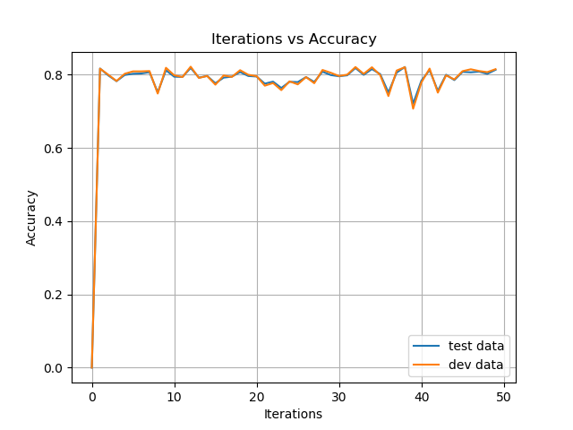
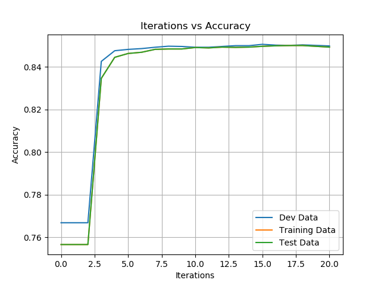

# Backpropagation 
## Patrick Phillips
This project implements a perceptron and then multilayer perceptron (neural net) from scratch and tests them on housing data from the US census in a simple classifcation problem deciding whether the house has price greater than $50,000.

First I implemented the perceptron algorithm in the folder [perceptron](https://github.com/peweetheman/Backpropagation/tree/master/perceptron). Experimenting with the performance as a function of iterations(which I plot below), I found that the accuracy did not really change as iterations increased. I use development data to loop through and choose which set of weights for iterations 1-50 performed best to then use on test data. By using the development data this way I help avoid overfitting.

 
I then create a two layer neural network and implement the apropriate [backpropogation](https://www.cs.swarthmore.edu/~meeden/cs81/s10/BackPropDeriv.pdf).I again use the development data to loop through and choose which set of weights over all iterations was optimal. Typically as the iterations increased the performance continued to increase, but I found that after about 10 iterations
there was little or no improvement in performance on dev data, suggesting that the weights had converged to optimal values already.

I also experimented with different learn rates and had the most success with consistent and quick convergence to an accuracy of about
85% when I used a lr of .1, I found that sometimes the success % would get stuck at the .7567 accuracy with different combinations of hyperparameters, which indicates that a local maxima was likely found. With higher learning rates over .01 this problem didn't occur, as the updates were significant enough to jump over this peak. I found that overall, the neural network was better than the perceptron. As shown in the graph above, I had results that peaked at roughly 85% accuracy which is about 5% better than the perceptron algorithm was able to do.

 
